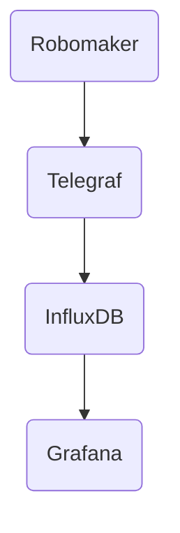

# Realtime Metrics

It is possible to collect and visualise real-time metrics using the optional telegraf/influxdb/grafana stack.

When enabled the Robomaker containers will send UDP metrics to Telegraf, which enriches and stores the metrics in the InfluxDB timeseries database container.

Grafana provides a presentation layer for interactive dashboards.

## Initial config and start-up

To enable the feature simply uncomment the lines in system.env for `DR_TELEGRAF_HOST` and `DR_TELEGRAF_PORT`. In most cases the default values should work without modification.

Start the metrics docker stack using `dr-start-metrics`. 

Once running Grafana should be accessible via a web browser on port 3000, e.g http://localhost:3000
The default username is `admin`, password `admin`. You will be prompted to set your own password on first login.

*Note: Grafana can take 60-90 seconds to perform initial internal setup the first time it is started. The web UI will not be available until this is complete. You can check the status by viewing the grafana container logs if necessary.*

The metrics stack will remain running until stopped (`dr-stop-metrics`) or the machine is rebooted. It does not need to be restarted in between training runs and should automatically pick up metrics from new models. 

## Using the dashboards

A template dashboard is provided to show how to access basic deepracer metrics. You can use this dashboard as a base to build your own more customised dashboards.

After connecting to the Grafana Web UI with a browser use the menu to browse to the Dashboards section. 

The template dashboard called `DeepRacer Training template` should be visible, showing graphs of reward, progress, and completed lap times. 

As this is an automatically provisioned dashboard you are not able to save changes to it, however you can copy it by clicking on the small cog icon to enter the dashboard settings page, and then clicking `Save as` to make an editable copy. 

A full user guide on how to work the dashboards is available on the [Grafana website](https://grafana.com/docs/grafana/latest/dashboards/use-dashboards/).

